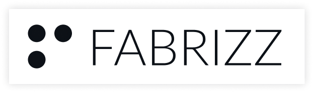

# ZPL-Renderer-JS (Fork)

This is a **fork** of [zpl-renderer-js](https://github.com/Fabrizz/zpl-renderer-js), a wrapper of [Zebrash by IngridHQ](https://github.com/ingridhq/zebrash). Convert Zebra ZPL labels to PNG **in the browser** or in Node.js—without third-party services like Labelary or labelzoom!, with support for multiple labels and templates.

> [!IMPORTANT]  
> **Barcode rendering fix** — This fork fixes upstream issues with **Code 128** barcodes (No-mode, ZPL escape `>5` for subset C). The fix is implemented **entirely in the WASM build** by vendoring a patched [Zebrash](https://github.com/ingridhq/zebrash) (`zebrash/zebrash-local/`). Previously, `>5` (switch to Code C) was mishandled: long digit sequences were encoded one character at a time instead of as digit pairs, making barcodes far too wide and causing overflow. With this fork, barcode width matches real Zebra hardware and Labelary. **Usable in the browser** — the WASM is inlined into the JS build; no external service or server is required.

[](https://www.npmjs.com/package/zpl-renderer-js)
[](https://xaviewer.fabriz.co/)


## Web Editor
You can use the full in-browser ZPL viewer+editor here: https://xaviewer.fabriz.co/
> Source code for XaViewer will be put public soon!


## Instalation
```bash
npm i zpl-renderer-js
```

## Usage
The NPM package includes `.umd`, `.esm`, and `.cjs` builds. **Runs fully in the browser** — no server or external API needed; the WASM runtime is inlined. You can find the raw WASM in the Github Releases.
> In case of using the raw `WASM` you will need to load `src/wasm_exec.js` and create a wrapper for the function.

> [!WARNING]  
> The output of this library (per build) is **~8MB** as the wasm is inlined inside so no resource has to be loaded separately. It is higly recommended that you use a bundler and lazy load the library (or the component that uses the lib.) <br/> In case of using the `.umd` build defer the load of the resource.

> [!NOTE]
> Loading the library in a web worker is also recommended and more so if you are planning on doing multiple renderings in a short time span. <br/> For now, you need to use a WebWorker manually. An example WebWorker can be found in `examples/1-zpl-web-worker.ts` and a consumer react component in `examples/1-zpl-ww-consumer.tsx`

### Rendering a single label (Original)
```ts
import { ready } from "zpl-renderer-js"
import fs from "node:fs";

const { api } = await ready;
const label = await api.zplToBase64Async("^XA^FO50,50^ADN,36,20^FDHello^FS^XZ");

fs.writeFileSync("zpl.png", Buffer.from(label, "base64"));
```

### Rendering multiple labels
```ts
import { ready } from "zpl-renderer-js"
import fs from "node:fs";

const { api } = await ready;
const labels = await api.zplToBase64MultipleAsync("...");

for (const label in labels) {
  fs.writeFileSync(`zpl-${labels.indexOf(label)}.png`, Buffer.from(label, "base64"));
}
```

### ZplApi
```ts
  /**
   * Asynchronously render a ZPL label into a PNG image (Base64-encoded string).
   *
   * @param zpl - The raw ZPL code to render.
   * @param widthMm - Label width in millimeters. Defaults to 101.6 mm (~4 inches).
   * @param heightMm - Label height in millimeters. Defaults to 203.2 mm (~8 inches).
   * @param dpmm - Dots per millimeter (print resolution). Defaults to 8 (~203 DPI).
   * @returns A Promise that resolves to a Base64-encoded PNG image string representing the rendered label.
   * @throws Will throw an error if the ZPL is invalid or rendering fails.
   */
  zplToBase64Async: (
    zpl: string,
    widthMm?: number,
    heightMm?: number,
    dpmm?: number
  ) => Promise<string>;

  /**
   * Asynchronously render multiple ZPL labels into PNG images (Base64-encoded strings).
   * 
   * @param zpl - The raw ZPL code containing multiple labels to render.
   * @param widthMm - Label width in millimeters. Defaults to 101.6 mm (~4 inches).
   * @param heightMm - Label height in millimeters. Defaults to 203.2 mm (~8 inches).
   * @param dpmm - Dots per millimeter (print resolution). Defaults to 8 (~203 DPI).
   * @returns A Promise that resolves to an array of Base64-encoded PNG image strings representing the rendered labels.
   * @throws Will throw an error if the ZPL is invalid or rendering fails.
   */

  zplToBase64MultipleAsync: (
    zpl: string,
    widthMm?: number,
    heightMm?: number,
    dpmm?: number
  ) => Promise<string[]>;
```
<br/>

<br/>

#

[](https://fabriz.co)
<p align="left">Made with 💛 by Fabrizz</p>